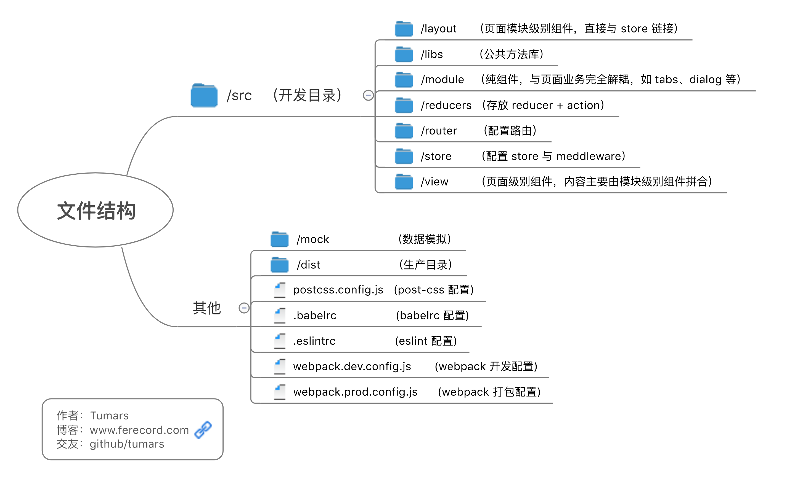

本项目主要作为 react 项目开发的启动模板。使用 webpack v3、react v16、react-router v4，相较旧模板有较大的变化。

> webpack 的具体使用及优化可参考我的博文 [webpack 使用总结](http://www.ferecord.com/webpack-summary.html) 。

> <del>组件的使用开发可参考 [ActiUI](https://tumars.github.io/ActiUI/) (自己写的 react component 组件库，该库目前用的仍是 webpack v1 及 react v13，参考就好，以后会更新)。</del>

> ActiUI 组件太久没更新，还是请直接参考本项目中 module 文件夹内的组件吧。此外推荐饿了么的 [element-react](https://github.com/eleme/element-react)，以及蚂蚁金服的 [Ant Design of React](https://ant.design/docs/react/introduce-cn)。


## 主要依赖及工具


## 功能
#### 主要功能
- [x] Hot Module Replacement 热加载
- [x] ESLint 检测
- [x] less 以及 autoprefixer 
- [x] 使用 cssModule
- [x] 小于 8k 图片转化为 base64
- [x] 组件内图标使用 svg
- [x] 文件压缩、添加 MD5
- [x] 引入 babel-polyfill, whatwg-fetch， 使用 ES6, Fetch
- [x] 使用 Redux DevTools ([安装浏览器插件](https://github.com/zalmoxisus/redux-devtools-extension))


### 组件
本项目用到的纯组件主要如下：

- <a href="https://github.com/tumars/boilerplate-webpack-react-es6-cssModule/tree/master/src/module">弹框 dialog</a>
- <a href="https://github.com/tumars/boilerplate-webpack-react-es6-cssModule/tree/master/src/module">走马灯 carousel</a>
- <a href="https://github.com/tumars/boilerplate-webpack-react-es6-cssModule/tree/master/src/module">标签页 tabs</a>
- <a href="https://github.com/tumars/boilerplate-webpack-react-es6-cssModule/tree/master/src/module">按钮 button</a>
- <a href="https://github.com/tumars/boilerplate-webpack-react-es6-cssModule/tree/master/src/module">列表载入 list-loading</a>

这些组件主要展示思路与方法，功能较基础，仅供参考。实际开发生产时请根据业务需求二次开发。

#### 补充说明
- 性能优化
	- <a href="#Reselect">Reselect</a>
	- <a href="#Immutable">Immutable</a>
	- <a href="#noindex">列表不要使用 index 作为 key</a>
	- <a href="#nocwa">不要在 componentWillAmount 中调用 setState</a>
	- <a href="#layout">注意动画渲染优化，使用 chrome 调试性能</a>
	- <a href="#userpd">使用 react-perf-devtool 调试性能</a>
- 其他技术选择
	- <a href="#VWVH">REM 与 VW、VH</a>
	- <a href="#async">promise 与 async 函数</a>
	- <a href="#Decorator">Decorator</a>
- <a href="#structure">目录文件结构说明</a>


#### 示例动图：

<!--  -->


## 使用
本项目使用`yarn`作为包管理，也可替换为`npm`。两者的差异请参阅[从 npm 客户端迁移](https://yarnpkg.com/zh-Hans/docs/migrating-from-npm)。无论使用哪个都建议将安装源替换为[淘宝镜像](https://npm.taobao.org/)。 

### 安装
```
git clone https://github.com/tumars/boilerplate-webpack-react-es6-cssModule
cd boilerplate-webpack-react-es6-cssModule
yarn install
```

### 开发
```
yarn start
```

访问 `http://localhost:3000/` 查看页面。


### mock 接口数据
本项目的接口数据通过 `json-server` 配置，需全局安装并启动：
（打开新命令行窗口）
```
yarn global add json-server 或 npm i -g json-server 
yarn run mock
```

接口将会在本地 3003 端口启动。


### 打包
Windows 用户使用：
```
yarn run build-win
```

Mac 用户使用：
```
yarn run build-mac
```

文件将会在`./dist`文件夹内生成。


可以使用`anywhere`工具建立本地服务查看页面：
```
yarn global add anywhere 或 npm i -g anywhere
cd ./dist
anywhere
```
页面会自动打开

## 补充说明

### <span id="Reselect">Reselect </span>
Reselect 库可以创建可记忆的(Memoized)、可组合的 selector 函数。Reselect selectors 可以用来高效地计算 Redux store 里的衍生数据。

使用 Reselect 相当一个缓存，使容器组件传递的 props 输入值不变时输出值不变，以减少显示组件的重复渲染。

本项目的 layout/data-list-tabs 文件内使用了 Reselect。

更多 Reselect 的访问跟介绍请访问：[https://github.com/reactjs/reselect](https://github.com/reactjs/reselect)

### <span id="Immutable">Immutable </span>
Immutable 是指数据不可变，如果你的数据嵌套格式比较深的话可以考虑使用，可以防止 javascript 引用类型带来的可能会不小心改变了原始数据的隐患。

当然如果你足够自信开发时会注意不改变原数据，就可以不用。本项目中是没使用的。

这是 Immutable.js 的文档页面：[https://facebook.github.io/immutable-js/](https://facebook.github.io/immutable-js/)

### <span id="noindex">列表不要使用 index 作为 key</span>
React Diff 算法中 React 会借助元素的 key 值来判断该元素是新近创建的还是被移动而来的元素，从而减少不必要的元素重渲染。
如果使用 index 来作为 key，当数据更新仅仅是数组重新排序或在其中间位置插入新元素，那么视图元素都将重新渲染。

### <span id="nocwa">不要在 componentWillAmount 中调用 setState</span>
在 componentWillAmount 没有意义，所有的 state 初始化应当在 this.state 中定义，而第一次 render 后改变 state 应当在 componentDidAmount 中执行。

### <span id="layout">注意动画渲染优化，使用 chrome 调试性能</span>
页面的图像渲染经过如下五个步骤

- script （js 计算）
- style （样式计算）
- layout （布局）
- paint （绘制）
- composite （合成）composite 

移动或变化页面元素时应当注意节省每一帧的渲染时间。
例如：

1. 优化 js 计算
	- 帧动画使用 requestAnimationFrame(fn) 替代 setTimeout(fn, 1000 / 60)。
	- 降低复杂性或使用 Web Worker。

2. 优化样式计算
	- 降低选择器的复杂性（使用 BEM 等命名方式替代类匹配）。
	- 减少要计算样式的元素数量。

3. 优化布局
	- 尽可能避免布局（layout）操作。

		> 如改变元素的“几何属性”（width、height、margin、left等）。

	- 使用 flexbox 而不是较早的布局模型。

		> 对于相同数量的元素和相同的视觉外观，flexbox 比浮动布局的时间要少得多。

	- 避免强制同步布局。

		> 避免先改变元素再获取与改变无关的样式，应当先读取样式值，然后进行样式更改。

	- 避免布局抖动。

		>即避免批量的连续强制同步布局。

4. 优化绘制
	- 尽可能避免绘制（paint）操作。

		>除 transform 或 opacity 属性之外，更改任何属性始终都会触发绘制，而绘制通常是像素管道（图面渲染）中开销最大的部分。

	- 通过层的提升来减少绘制区域。

		>（浏览器的绘制是像 ps 图层一样分层绘制的，对必要的动画元素使用 `will-change: transform;` 或 `transform: translateZ(0);` 以使浏览器对该元素创建新的合成器层，这样该元素的绘制不会影响其他元素。但需要注意不要创建太多层，因为每层都需要内存和管理开销）。

	- 通过动画的编排来减少绘制区域。

		> 浏览器会将两个需要绘制的区域联合在一起，而这可能会导致整个屏幕重绘。举例而言，如果页面顶层有一个固定标头，而在屏幕底部还有正在绘制的元素，则整个屏幕可能最终要重绘。减少绘制区域往往是编排您的动画和变换，使其不过多重叠，或设法避免对页面的某些部分设置动画。

	- 降低绘制的复杂性。

		> 一些绘制比其他绘制的开销更大，例如，绘制任何涉及模糊（例如阴影）的元素所花的时间将比（例如）绘制一个红框的时间要长。例如 `background: red;` 和 `box-shadow: 0, 4px, 4px, rgba(0,0,0,0.5); `,前者的绘制时间更短。

5. 其他
	- 对连续输入使用函数节流或防抖，防止长时间运行输入程序导致合成器线程被阻塞。另外一些情况下可以使用 requestAnimationFrame 来替代节流函数。
	- 使用 Chrome DevTools 来进行性能分析（Performance、Layers、Rendering 等）。


### <span id="userpd">使用 react-perf-devtool 调试性能</span>


###  <span id="VWVH">REM 与 VW、VH </span>
之前使用 rem 布局，后来看了[再聊移动端页面的适配](https://www.w3cplus.com/css/vw-for-layout.html),决定使用 vw、vh 布局，配合 [postcss-px-to-viewport](https://github.com/evrone/postcss-px-to-viewport)和 [viewport-units-buggyfill](https://github.com/rodneyrehm/viewport-units-buggyfill) 能通过大部分机型的测试。

> 经测试发现 viewport-units-buggyfill 在处理 base64 背景图片的 vw vh 时会导致图片出错，请注意。

当然使用 rem 布局还是最安全的，提供三个方案：

1. 参考本项目 v2 版本使用 js 控制 html 的 font-size 。
2. 使用 [postcss-pxtorem](https://github.com/cuth/postcss-pxtorem)。
3. 使用淘宝的 [lib-flexible](https://github.com/amfe/lib-flexible)，这个是最推荐的。


###  <span id="async">async 函数  </span>
本项目中的获取接口数据处的异步处理使用的是 async 函数，相比 Promise 直观、方便了许多。

###  <span id="Decorator">Decorator </span>
本项目的一些组件使用了 Decorator（修饰器）的写法，例如 module/mo-carousel。以及 css module 也是以 Decorator 的方式使用。


###  <span id="structure">目录文件结构 </span>



## 主要版本变化

#### v3
- 主要使用 webpack v3 + react v16 + react-router v4
- 更改文件结构，组件更新
- Promise 改为 async await
- rem 布局改为 vw、vh，使用 postcss-px-to-viewport 配置
- 动画组件依赖更新至 react-transition-group


#### [v2](https://github.com/tumars/boilerplate-webpack-react-es6-cssModule/tree/master/webpack1.x)
主要使用 webpack v2 + react v15 + react-router v4

#### [v1](https://github.com/tumars/boilerplate-webpack-react-es6-cssModule/tree/master/webpack1.x)
主要使用 webpack v1 + react v13 + react-router v2


## 联系我
如有问题请提 issue，或通过以下方式联系到我：
 - 邮箱 menghui9898@gmail.com
 - 博客 [ferecord.com](http://www.ferecord.com/ "前端记录 ")
 - Twitter [@Tumars](https://twitter.com/Tumars)

 欢迎指教交流 🙆‍


