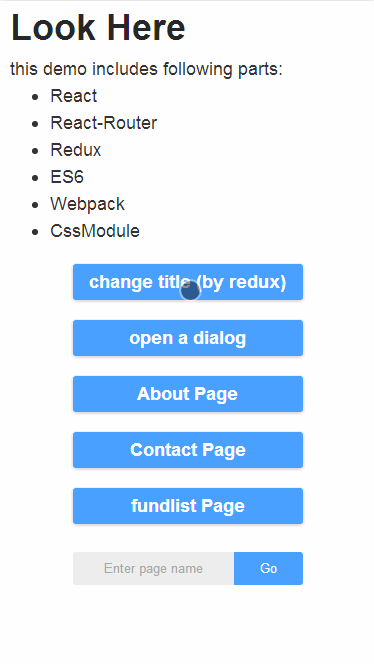

本项目主要作为 react 项目开发的启动模板。使用 webpack v2、react v15、react-router v4，相较旧模板有较大的变化。

> webpack 的具体使用及优化可参考我的博文 [webpack 使用总结](http://www.ferecord.com/webpack-summary.html) 。

> 组件的使用开发可参考 [ActiUI](https://tumars.github.io/ActiUI/) (自己写的 react component 组件库，该库目前用的仍是 webpack v1 及 react v13，参考就好，以后会更新)。

## 主要包及版本
- 包管理


- 依赖


- 工具


## 主要功能
- [x] Hot Module Replacement 热加载
- [x] ESLint 检测
- [x] less 以及 autoprefixer 
- [x] 使用 cssModule
- [x] 小于 8k 图片转化为 base64
- [x] 组件内图标使用 svg
- [x] 文件压缩、添加 MD5
- [x] 引入 babel-polyfill, whatwg-fetch， 使用 ES6, Fetch
- [x] 使用 Redux DevTools ([安装浏览器插件](https://github.com/zalmoxisus/redux-devtools-extension))

---------

#### 页面效果如下：




## 使用
本项目使用`yarn`作为包管理，也可替换为`npm`。两者的差异请参阅[从 npm 客户端迁移](https://yarnpkg.com/zh-Hans/docs/migrating-from-npm)。无论使用哪个都建议将安装源替换为[淘宝镜像](https://npm.taobao.org/)。 

#### 安装
```
git clone https://github.com/tumars/boilerplate-webpack-react-es6-cssModule
cd boilerplate-webpack-react-es6-cssModule
yarn install
```

#### 开发
```
yarn start
```

访问 `http://localhost:3000/#/home` 查看页面。

#### mock 接口数据
本项目的接口数据通过 `json-server` 配置，需全局安装并启动：
（打开新命令行窗口）
```
yarn global add json-server 或 npm i -g json-server 
yarn run mock
```

接口将会在本地 3003 端口启动。

#### 打包
Windows 用户使用：
```
yarn run build-win
```

Mac 用户使用：
```
yarn run build-mac
```

文件将会在`./dist`文件夹内生成。


可以使用`anywhere`工具建立本地服务查看页面：
```
yarn global add anywhere 或 npm i -g anywhere
cd ./dist
anywhere
```
页面会自动打开（地址要加上 /#/home）

## 主要版本变化

#### v0.2
主要使用 webpack v2 + react v15 + react-router v4

#### [v0.1](https://github.com/tumars/boilerplate-webpack-react-es6-cssModule/tree/master/webpack1.x)
主要使用 webpack v1 + react v13 + react-router v2


## 联系我
如有问题请提 issue，或通过以下方式联系到我：
 - 邮箱 menghui9898@gmail.com
 - 博客 [ferecord.com](http://www.ferecord.com/ "前端记录 ")
 - Twitter [@Tumars](https://twitter.com/Tumars)


