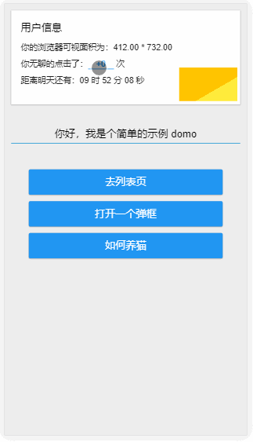

本项目主要作为 react 项目开发的启动模板。使用 webpack v3、react v16、react-router v4，相较旧模板有较大的变化。

> webpack 的具体使用及优化可参考我的博文 [webpack 使用总结](http://www.ferecord.com/webpack-summary.html) 。

> <del>组件的使用开发可参考 [ActiUI](https://tumars.github.io/ActiUI/) (自己写的 react component 组件库，该库目前用的仍是 webpack v1 及 react v13，参考就好，以后会更新)。</del>

> ActiUI 组件太久没更新了，还是请直接参考本项目中 module 文件夹内的组件吧。此外推荐饿了么的 [element-react](https://github.com/eleme/element-react)，以及蚂蚁金服的 [Ant Design of React](https://ant.design/docs/react/introduce-cn)。


## 主要包及版本
- 包管理


- 主要依赖


- 主要工具


## 功能
#### 主要功能
- [x] Hot Module Replacement 热加载
- [x] ESLint 检测
- [x] less 以及 autoprefixer 
- [x] 使用 cssModule
- [x] 小于 8k 图片转化为 base64
- [x] 组件内图标使用 svg
- [x] 文件压缩、添加 MD5
- [x] 引入 babel-polyfill, whatwg-fetch， 使用 ES6, Fetch
- [x] 使用 Redux DevTools ([安装浏览器插件](https://github.com/zalmoxisus/redux-devtools-extension))

#### 补充说明
- <a href="#Reselect">Reselect</a>
- <a href="#Immutable">Immutable</a>
- <a href="#VWVH">REM 与 VW、VH</a>
- <a href="#async">async 函数</a>
- <a href="#Decorator">Decorator</a>


#### 示例动图：

<!--  -->


## 使用
本项目使用`yarn`作为包管理，也可替换为`npm`。两者的差异请参阅[从 npm 客户端迁移](https://yarnpkg.com/zh-Hans/docs/migrating-from-npm)。无论使用哪个都建议将安装源替换为[淘宝镜像](https://npm.taobao.org/)。 

#### 安装
```
git clone https://github.com/tumars/boilerplate-webpack-react-es6-cssModule
cd boilerplate-webpack-react-es6-cssModule
yarn install
```

#### 开发
```
yarn start
```

访问 `http://localhost:3000/` 查看页面。


#### mock 接口数据
本项目的接口数据通过 `json-server` 配置，需全局安装并启动：
（打开新命令行窗口）
```
yarn global add json-server 或 npm i -g json-server 
yarn run mock
```

接口将会在本地 3003 端口启动。


#### 打包
Windows 用户使用：
```
yarn run build-win
```

Mac 用户使用：
```
yarn run build-mac
```

文件将会在`./dist`文件夹内生成。


可以使用`anywhere`工具建立本地服务查看页面：
```
yarn global add anywhere 或 npm i -g anywhere
cd ./dist
anywhere
```
页面会自动打开

## 补充说明

#### <span id="Reselect">Reselect </span>
Reselect 库可以创建可记忆的(Memoized)、可组合的 selector 函数。Reselect selectors 可以用来高效地计算 Redux store 里的衍生数据。

使用 Reselect 相当一个缓存，是容器组件传递的 props 输入值不变时输出值不变，以减少显示组件的重复渲染。

本项目的 layout/data-list-tabs 文件内使用了 Reselect。

更多 Reselect 的访问跟介绍请访问：[https://github.com/reactjs/reselect](https://github.com/reactjs/reselect)

#### <span id="Immutable">Immutable </span>
Immutable 是指数据不可变，如果你的数据嵌套格式比较深的话可以考虑使用，可以防止 javascript 引用类型带来的可能会不小心改变了原始数据的隐患(在 react redux 里原始数据改变可能会导致重复渲染等问题)。

当然如果你足够自信开发时会注意不改变原数据，就可以不用。本项目中是没使用的。

这是 Immutable.js 的文档页面：[https://facebook.github.io/immutable-js/](https://facebook.github.io/immutable-js/)


####  <span id="VWVH">REM 与 VW、VH </span>
之前使用 rem 布局，后来看了[再聊移动端页面的适配](https://www.w3cplus.com/css/vw-for-layout.html),决定使用 vw、vh 布局，配合 [postcss-px-to-viewport](https://github.com/evrone/postcss-px-to-viewport)和 [viewport-units-buggyfill](https://github.com/rodneyrehm/viewport-units-buggyfill) 能通过大部分机型的测试。

当然使用 rem 布局还是最安全的，提供三个方案：
- 1. 参考本项目 v2 版本使用 js 控制 html 的 font-size 。
- 2. 使用 [postcss-pxtorem](https://github.com/cuth/postcss-pxtorem)。
- 3. 使用淘宝的 [lib-flexible](https://github.com/amfe/lib-flexible)，这个是最推荐的。


####  <span id="async">async 函数  </span>
本项目中的获取接口数据处的异步处理使用的是 async 函数，相比 Promise 直观、方便了许多。

####  <span id="Decorator">Decorator </span>
本项目的一些组件使用了 Decorator（修饰器）的写法，例如 module/mo-carousel。以及 css module 也是以 Decorator 的方式使用。


## 主要版本变化

#### v3
- 主要使用 webpack v3 + react v16 + react-router v4
- 更改文件结构，组件更新
- Promise 改为 async await
- rem 布局改为 vw、vh，使用 postcss-px-to-viewport 配置
- 动画组件依赖更新至 react-transition-group


#### [v2](https://github.com/tumars/boilerplate-webpack-react-es6-cssModule/tree/master/webpack1.x)
主要使用 webpack v2 + react v15 + react-router v4

#### [v1](https://github.com/tumars/boilerplate-webpack-react-es6-cssModule/tree/master/webpack1.x)
主要使用 webpack v1 + react v13 + react-router v2


## 联系我
如有问题请提 issue，或通过以下方式联系到我：
 - 邮箱 menghui9898@gmail.com
 - 博客 [ferecord.com](http://www.ferecord.com/ "前端记录 ")
 - Twitter [@Tumars](https://twitter.com/Tumars)


